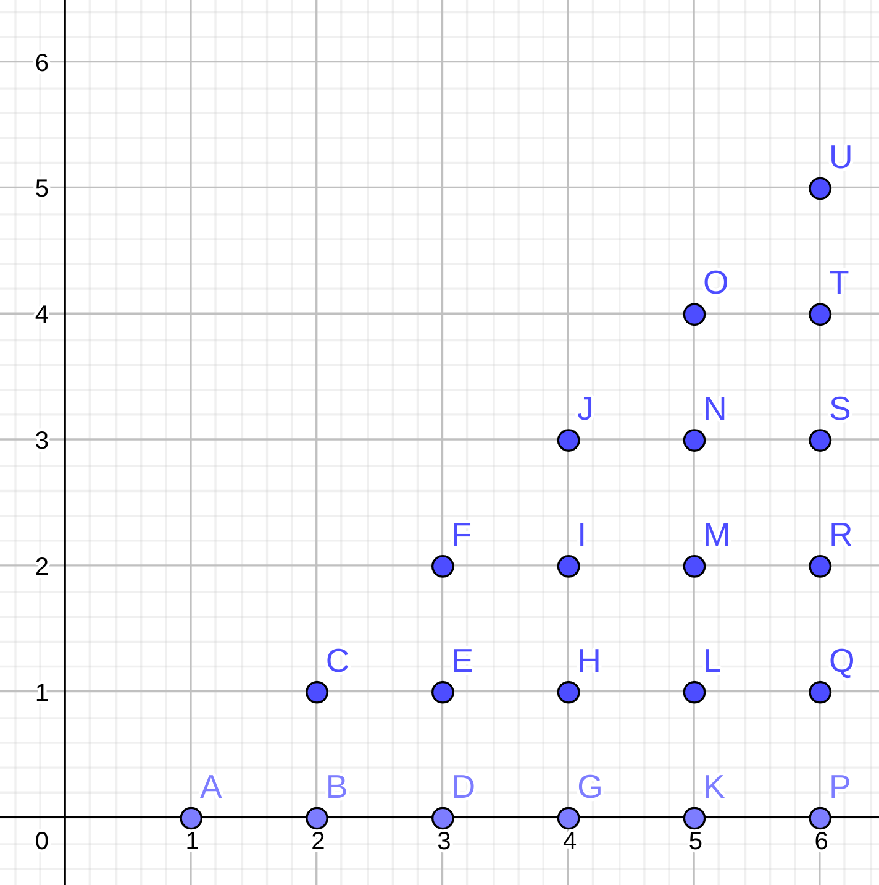

# 백준 16287 Parcel

## $O(n^4)$ 알고리즘

${}_n\mathrm{C}_4$개를 모두 검사해 보면 된다. 물론 시간초과가 뜬다.

## $O(n^2)$ 알고리즘

사실 이 문제와 비슷한 문제를 어디서 들어봤을 것이다.

> $n$개의 서로 다른 정수가 있는 배열에서, 합이 $A$인 쌍이 존재하는가?

나이브하게 풀면 $O(n^2)$이지만, 더 빠르게 풀 수 있다.

1. 모든 원소 $x$에 대해 $A-x$의 값들을 집합에 넣는다.
2. 모든 원소 $x$에 대해 $A-x$의 값이 집합에 존재하는지 확인한다.

집합이라고 했지만, $x$의 범위가 적절하게 정해져 있다면 배열로 구현할 수 있고, 집합에 넣는 연산은 $O(1)$이다. 1, 2단계 모두 $n$번 반복하므로 이 알고리즘은 $O(n)$이다.

이 문제에서도 비슷한 접근을 취할 수 있다. $b_1, b_2, b_3, b_4\in B$에 대해, $b_1+b_2+b_3+b_4=w$ 이므로, $b_1+b_2=w-(b_3+b_4)$를 사용하면 된다. 문제를 해결하는 알고리즘은 다음과 같다.

1. `weights`라는 집합을 선언한다. 이 집합은 두 소포의 무게 합을 저장한다.
2. `i`라는 변수를 두고 0부터 `n - 1`까지 반복한다.
   1. `j`에 대해 `i + 1`부터 `n - 1`까지 반복한다.
      1. `i`번째 소포와 `j`번째 소포의 무게 합을 `w`에서 뺀 원소가 `weights`에 있는지 확인한다.
      2. 있으면 YES를 출력하고 끝낸다.
   2. `j`에 대해 0부터 `i - 1`까지 반복한다.
      1. `i`번째 소포와 `j`번째 소포의 무게 합을 `weights`에 저장해 준다.

이 알고리즘에서는 몇 가지 의문점이 생긴다.

> **의문점 1.** 2-1-1 단계에서 찾는 무게를 만들기 위해, `i`번째 또는 `j`번째 소포가 필요하지 않을까?

2-1 단계의 반복문에서 `weights`에 있는 무게들은 (1, 0), (2,0), (2, 1), (3, 0), ..., (`i` - 1, 0), ..., (`i` - 1, `i` - 2)번째 소포들의 쌍으로 얻은 것이다. 한편, 2-1-1단계에서는 (`i`, `j`)번째 소포의 쌍을 고려하고 있다. `weights`에 있는 소포들의 쌍 모두 `i`번째 소포를 포함하지 않으므로, 찾는 무게를 만들기 위해 `i`번째 혹은 `j`번째 소포가 필요한, '겹치는' 상황은 일어나지 않는다.

> **의문점 2.** 알고리즘에서 모든 조합을 고려할까?

`i`번째 소포와 `ㅓ`번째 소포를 고르는 것을 (`i`, `j`)로 좌표평면에 나타내 보자. (`i`, `j`)와 (`j`, `i`)중 한 개만 나와야 하고, `i != j`여야 하므로 `i > j`라고 하면 다음과 같은 삼각형이 생긴다.

2-2단계 반복문에서는 `weights` 집합을 A, B, C, D, E, F, ...의 순서로 채운다. 또한, 2-1단계 반복문에서는 `i`번째 반복에서 `x = i` 위에 있는 점들에 대해서 합을 `w`로 만들수 있는지 확인하므로 모든 조합을 고려한다고 할 수 있다.